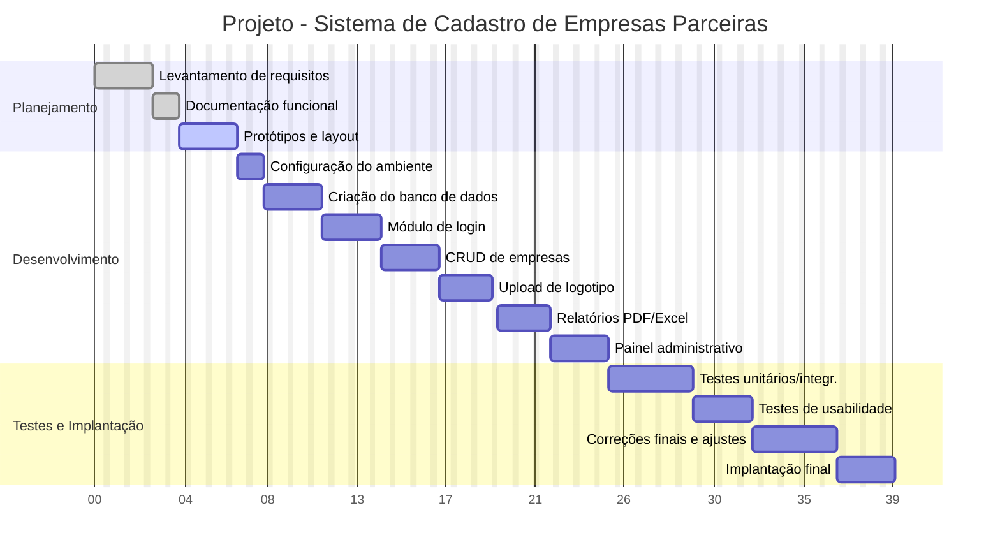
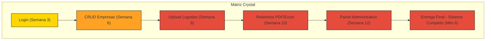

# Atividade-GANTT-CRYSTAL
Atividade da aula de Gestão Ágil de Projetos de Software

A empresa TechConnect Solutions foi contratada por uma rede de associações comerciais para desenvolver um Sistema de Cadastro de Empresas Parceiras. O prazo de entrega é de 6 meses e a equipe designada para o projeto é composta por um gerente de projetos, um analista de sistemas, dois desenvolvedores, um designer de interface e um tester (QA).

O sistema solicitado deve contemplar os seguintes requisitos:
•	Área de login com autenticação de usuários e recuperação de senha.
•	Cadastro de empresas (inserir, editar, excluir e listar empresas parceiras).
•	Upload de logotipo de cada empresa, armazenando a imagem no servidor.
•	Relatórios básicos em PDF ou Excel contendo a lista de empresas parceiras ativas.
•	Painel administrativo com permissões de acesso para diferentes tipos de usuários.
•	Interface responsiva, acessível por desktop e dispositivos móveis.
•	Banco de dados integrado, garantindo segurança e consistência das informações.

O projeto terá início com o levantamento de requisitos junto ao cliente, seguido pela documentação funcional preparada pelo analista. O designer será responsável por elaborar rascunhos das telas e depois criar o layout definitivo do sistema.

Na etapa de desenvolvimento, a equipe seguirá esta ordem:

1.	Configuração do ambiente de desenvolvimento (instalação de frameworks, integração com banco de dados MySQL e controle de versão no Git).
2.	Criação do banco de dados com tabelas para empresas, usuários e permissões.
3.	Programação do módulo de login, com autenticação, recuperação de senha e validação de acesso.
4.	Programação do CRUD de empresas (cadastro, edição, exclusão e listagem de empresas).
5.	Implementação do upload de logotipo, incluindo tratamento de formatos de imagem e armazenamento seguro no servidor.
6.	Desenvolvimento dos relatórios (exportação em PDF e Excel).
7.	Configuração do painel administrativo, controlando permissões de acordo com o perfil do usuário.
8.	Testes unitários e de integração, realizados pelo QA, com relatórios de falhas e correções.
9.	Testes de usabilidade com usuários convidados.
10.	Implantação final no servidor e entrega ao cliente.

Além disso, o gerente de projetos decidiu acompanhar o projeto de duas formas:
1.	Gráfico de Gantt – para organizar visualmente as atividades, mostrando a sequência, duração e responsáveis de cada etapa, garantindo o cumprimento do prazo de 6 meses.

2.	Método Ágil Crystal Clear – por ser uma equipe pequena, a comunicação será feita em reuniões diárias rápidas, e o sistema será entregue de forma incremental.

No Crystal, as entregas parciais foram planejadas da seguinte maneira:
•	Entrega 1 (Semana 3): módulo de login funcionando com autenticação.
•	Entrega 2 (Semana 6): CRUD de empresas ativo.
•	Entrega 3 (Semana 8): upload de logotipo integrado ao cadastro.
•	Entrega 4 (Semana 10): relatórios gerados em PDF e Excel.
•	Entrega 5 (Semana 12): painel administrativo com permissões configuradas.
•	Entrega final (Mês 6): sistema testado, implantado e validado pelo cliente.

A cada entrega parcial, a diretoria será convidada para revisar as funcionalidades, sugerir melhorias e validar os requisitos, garantindo que o sistema corresponda às necessidades da rede de associações.

GANTT

  CRYSTAL

