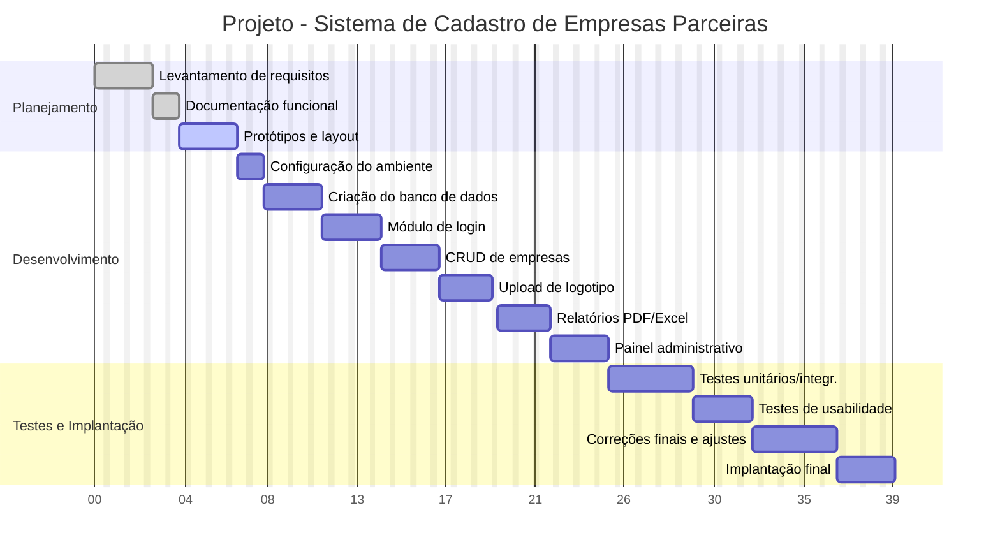
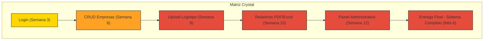

# Atividade-GANTT-CRYSTAL
Atividade da aula de Gestão Ágil de Projetos de Software

GANTT

```mermaid
gantt
    title Projeto - Sistema de Cadastro de Empresas Parceiras
    dateFormat  YYYY-MM-DD
    axisFormat  %W
    excludes    weekends

    section Planejamento
    Levantamento de requisitos      :done,    req, 2025-01-01, 14d
    Documentação funcional          :done,    doc, after req, 7d
    Protótipos e layout             :active,  design, after doc, 14d

    section Desenvolvimento
    Configuração do ambiente        :dev1, after design,7d
    Criação do banco de dados       :dev2, after dev1, 14d
    Módulo de login                 :dev3, after dev2, 14d
    CRUD de empresas                :dev4, after dev3, 14d
    Upload de logotipo              :dev5, after dev4, 14d
    Relatórios PDF/Excel            :dev6, after dev5, 14d
    Painel administrativo           :dev7, after dev6, 14d

    section Testes e Implantação
    Testes unitários/integr.        :qa1, after dev7, 21d
    Testes de usabilidade           :qa2, after qa1, 14d
    Correções finais e ajustes      :qa3, after qa2, 21d
    Implantação final               :qa4, after qa3, 14d
```

  CRYSTAL

```mermaid

graph TD
   subgraph Matriz Crystal
E1["Login (Semana 3)"]:::amarelo --> E2["CRUD Empresas (Semana 6)"]:::laranja --> E3["Upload Logotipo (Semana 8)"]:::vermelho --> E4["Relatórios PDF/Excel (Semana 10)"]:::vermelho --> E5["Painel Administrativo (Semana 12)"]:::vermelho --> E6["Entrega Final - Sistema Completo (Mês 6)"]:::vermelho
   end

classDef branco fill:#fff, stroke:#000, stroke-width:1px;
classDef amarelo fill:#FFD700, stroke:#000, stroke-width:1px;
classDef laranja fill:#FFA223, stroke:#000, stroke-width:1px;
classDef vermelho fill:#E64C3C, stroke:#000, stroke-width:1px;
```
